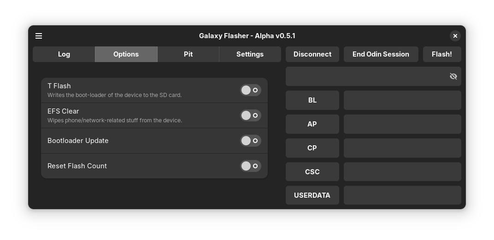
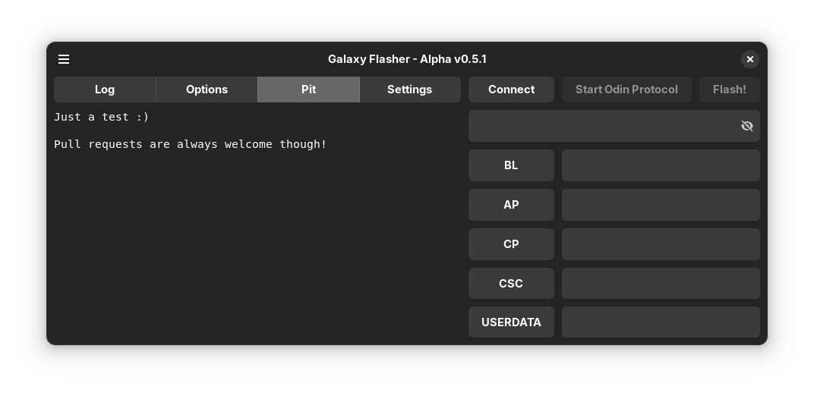
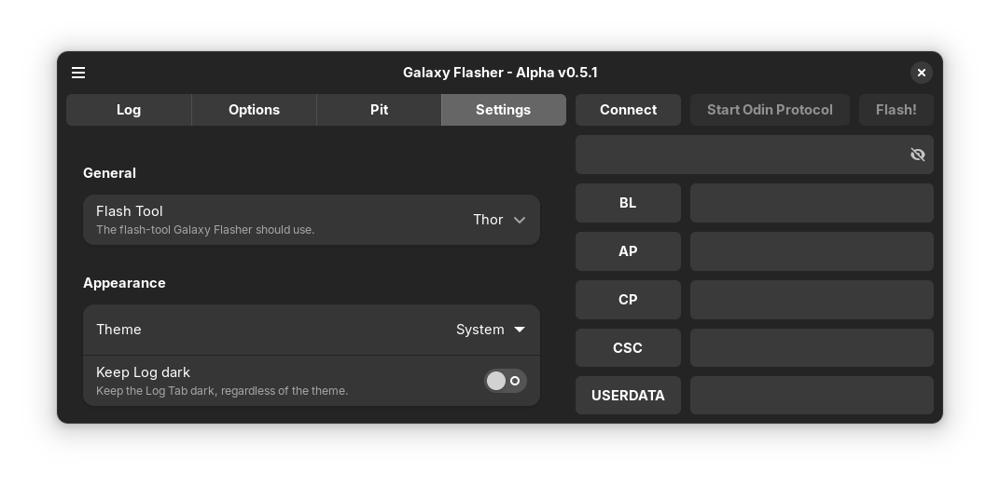
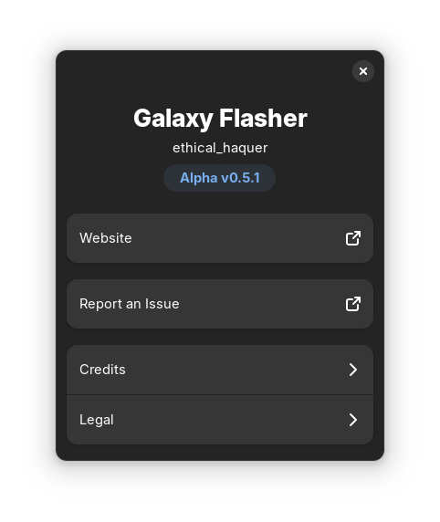
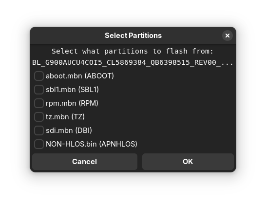
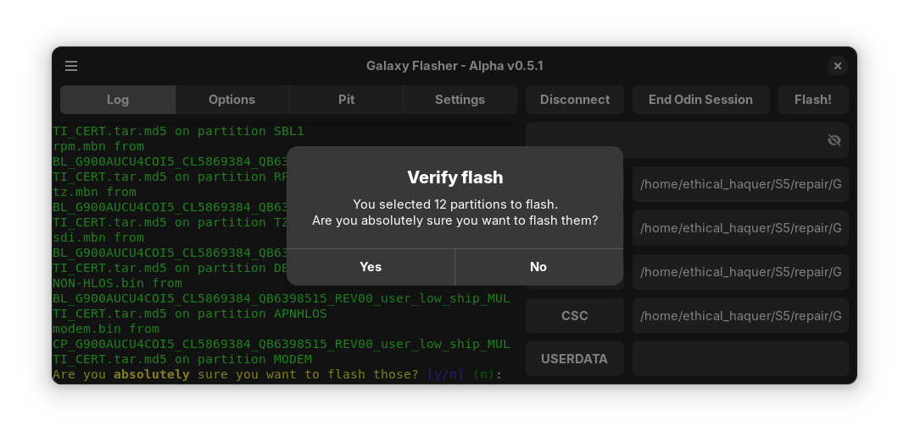

Have any ideas for the icon? Let me know on [Codeberg](https://codeberg.org/ethical_haquer/Galaxy-Flasher/issues/21), [GitHub](https://github.com/ethical-haquer/Galaxy-Flasher/issues/21), or [XDA](https://xdaforums.com/t/linux-galaxy-flasher-a-gui-for-samsung-flash-tools.4636402/page-4#post-89701721).

<h1 align="center">Galaxy Flasher</h1>

A GUI for Samsung flash-tools.

[Codeberg](https://codeberg.org/ethical_haquer/Galaxy-Flasher) | [GitHub](https://github.com/ethical-haquer/Galaxy-Flasher) | [XDA](https://xdaforums.com/t/linux-galaxy-flasher-a-gui-for-samsung-flash-tools.4636402/)

  
<b>Screenshots</b>

   
  Options Tab:
   
  <picture>
    <source media="(prefers-color-scheme: dark)" srcset="/assets/screenshots/galaxy-flasher-options-tab-dark.png">
    <source media="(prefers-color-scheme: light)" srcset="/assets/screenshots/galaxy-flasher-options-tab-light.png">
    
  </picture>
   
  Pit Tab:
   
  <picture>
    <source media="(prefers-color-scheme: dark)" srcset="/assets/screenshots/galaxy-flasher-pit-tab-dark.png">
    <source media="(prefers-color-scheme: light)" srcset="/assets/screenshots/galaxy-flasher-pit-tab-light.png">
    
  </picture>
   
  Settings Tab:
   
  <picture>
    <source media="(prefers-color-scheme: dark)" srcset="/assets/screenshots/galaxy-flasher-settings-tab-dark.png">
    <source media="(prefers-color-scheme: light)" srcset="/assets/screenshots/galaxy-flasher-settings-tab-light.png">
    
  </picture>
   
  About Dialog:
   
  <picture>
    <source media="(prefers-color-scheme: dark)" srcset="/assets/screenshots/galaxy-flasher-about-dialog-dark.png">
    <source media="(prefers-color-scheme: light)" srcset="/assets/screenshots/galaxy-flasher-about-dialog-light.png">
    
  </picture>
   
  Select Partitions Window:
   
  <picture>
    <source media="(prefers-color-scheme: dark)" srcset="/assets/screenshots/galaxy-flasher-select-partitions-window-dark.png">
    <source media="(prefers-color-scheme: light)" srcset="/assets/screenshots/galaxy-flasher-select-partitions-window-light.png">
    
  </picture>
   
  Verify Flash Dialog:
   
  <picture>
    <source media="(prefers-color-scheme: dark)" srcset="/assets/screenshots/galaxy-flasher-verify-flash-dialog-dark.png">
    <source media="(prefers-color-scheme: light)" srcset="/assets/screenshots/galaxy-flasher-verify-flash-dialog-light.png">
    
  </picture>

## Background

After witnessing a new Linux user, who had just switched over from Windows, struggle with using Odin4's CLI, I decided to make a GUI for Thor: Thor GUI. With the release of v0.5.0, Thor GUI was renamed Galaxy Flasher, and it now supports Thor and Odin4.

## Disclaimer

Currently, Galaxy Flasher is in an Alpha stage. There are known (and probably unknown) bugs. A list of missing features and know bugs in the **latest release** can be found below.

## Known Bugs

- Setting options through the Options Tab is buggy.

## TODO

- Improve the Options Tab for Thor
- Display the partitions to be flashed in the Verify Flash Window
- Use an Adw.Dialog for the Select Partitions Window
- Hide Thor-specific settings if the current flash-tool is not Thor
- Publish Galaxy Flasher on FlatHub

## Supported platforms

- [x] Linux x64
- [ ] Linux arm64 (WIP, only Thor can be used, untested)
- [ ] Windows
- [ ] macOS

## Supported flash-tools

- Thor
- Odin4
- PyThor (in development)

## Installation and Usage

For how to install and use Galaxy Flasher, refer to the [Galaxy Flasher documentation](https://galaxy-flasher-docs.readthedocs.io/en/latest/).

## How you can help

Here are some ways you can help me improve/finish Thor GUI:
+ Galaxy Flasher needs a logo! If you would be interested in making one, please open a new issue.
+ Find and report bugs. If you find an issue that isn't listed as a [known bug](https://github.com/ethical-haquer/Galaxy-Flasher?tab=readme-ov-file#tabs), and isn't listed [here](https://github.com/ethical-haquer/Galaxy-Flasher/issues), please let me know!
+ ~Help translate Galaxy Flasher into your language. Refer to [this readme](https://github.com/ethical-haquer/Galaxy-Flasher/blob/main/locales/README.md) for more info~. NOTE: Currently, the en.json file is in dire need of updating after the re-write, so please don't add other translations until it is updated. Thanks!
+ Improve the code. Pull requests are always welcome!
+ Suggest an improvement by opening up a [feature request](https://github.com/ethical-haquer/Galaxy-Flasher/issues/new/choose)!

## Credits

[TheAirBlow](https://github.com/theairblow) for posting [Odin4](https://xdaforums.com/t/official-samsung-odin-v4-1-2-1-dc05e3ea-for-linux.4453423/) to XDA, and for creating the [Thor Flash Utility](https://github.com/Samsung-Loki/Thor).

[justaCasualCoder](https://github.com/justaCasualCoder) for his contributions, and for starting the port to GTK4 on his own.

[Not_Rich@XDA](https://xdaforums.com/m/not_rich.8463826/) for continuing to test out new versions and suggest improvements.

[ethical_haquer](https://github.com/ethical-haquer) for Galaxy Flasher.

## License

Galaxy Flasher is licensed under GPLv3. Please see [`LICENSE`](./LICENSE) for the full license text.
