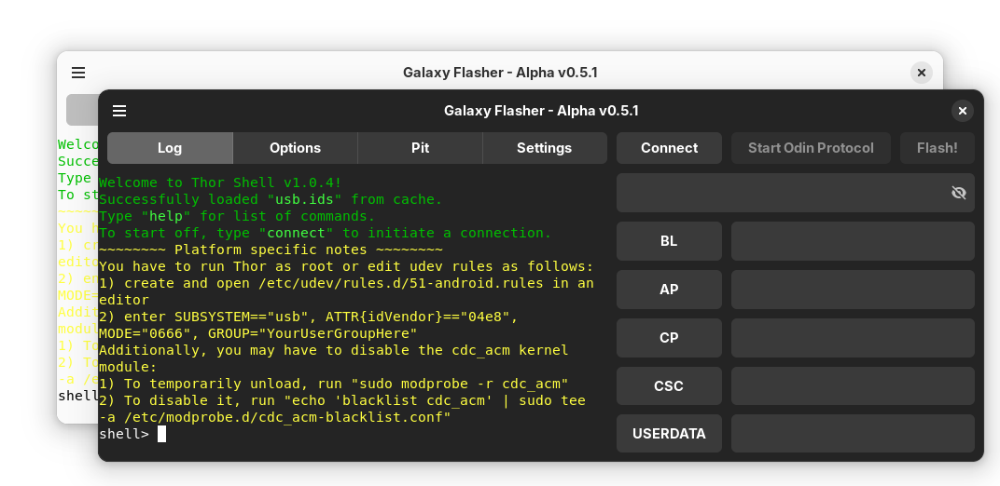

# Galaxy Flasher

 

A GUI for Samsung flash-tools.
<picture>
  <source media="(prefers-color-scheme: dark)" srcset="images/galaxy-flasher-dark-light.png">
  <source media="(prefers-color-scheme: light)" src="images/galaxy-flasher-light-dark.png">
  
</picture>

  
<b>Screenshots</b>

   
  Options Tab:
   
  <picture>
    <source media="(prefers-color-scheme: dark)" srcset="https://github.com/user-attachments/assets/fbcb8c93-4461-42be-874a-8bd39d6f23cb">
    <source media="(prefers-color-scheme: light)" srcset="ttps://github.com/user-attachments/assets/1a926363-79dc-494a-910e-dc8b359fb864">
    
  </picture>
   
  Pit Tab:
   
  <picture>
    <source media="(prefers-color-scheme: dark)" srcset="https://github.com/user-attachments/assets/d10aecd0-633f-4c20-a738-d56dad080772">
    <source media="(prefers-color-scheme: light)" srcset="https://github.com/user-attachments/assets/ab4ffcf2-1198-43dd-9b2d-a20841821eaf">
    
  </picture>
   
  Settings Tab:
   
  <picture>
    <source media="(prefers-color-scheme: dark)" srcset="https://github.com/user-attachments/assets/d3f424ad-25c5-4e40-ba74-75ed5713e2ab">
    <source media="(prefers-color-scheme: light)" srcset="https://github.com/user-attachments/assets/6340bddb-ad4d-4567-bc97-8f028bbb7865">
    
  </picture>
   
  About Dialog:
   
  <picture>
    <source media="(prefers-color-scheme: dark)" srcset="https://github.com/user-attachments/assets/5e6b5625-4cde-43a4-a459-44d943cfbe74">
    <source media="(prefers-color-scheme: light)" srcset="https://github.com/user-attachments/assets/788a7330-69dd-43ea-9cfa-3be68f1c058b">
    
  </picture>
   
  "Select Partitions" Window:
   
  <picture>
    <source media="(prefers-color-scheme: dark)" srcset="https://github.com/user-attachments/assets/91c6b476-3917-42c4-9d9a-1ac3f3bf931a">
    <source media="(prefers-color-scheme: light)" srcset="https://github.com/user-attachments/assets/c1b972a5-a9e1-4e02-81e4-cce970cea5c4">
    
  </picture>
   
  "Verify Flash" Window:
   
  <picture>
    <source media="(prefers-color-scheme: dark)" srcset="https://github.com/user-attachments/assets/ef054041-001a-483e-a438-073b6a49276d">
    <source media="(prefers-color-scheme: light)" srcset="https://github.com/user-attachments/assets/90cd9c3a-dc40-4538-837e-571e7c22b8e2">
    
  </picture>

## Background

After witnessing a new Linux user, who had just switched over from Windows, struggle with using Odin4's CLI, I decided to make a GUI for Thor: Thor GUI. With the release of v0.5.0, Thor GUI was renamed Galaxy Flasher, and it now supports Thor and Odin4.

## Disclaimer

Currently, Galaxy Flasher is in an Alpha stage. There are known (and probably unknown) bugs. A list of missing features and know bugs in the **latest release** can be found below.

## Known Bugs

- Setting options through the Options Tab is buggy.

## TODO

- Improve the Options Tab for Thor
- Display the partitions to be flashed in the Verify Flash Window
- Use an Adw.Dialog for the Select Partitions Window
- Hide Thor-specific settings if the current flash-tool is not Thor
- Publish Galaxy Flasher on FlatHub

## Supported platforms

- [x] Linux x64
- [ ] Linux arm64 (WIP, only Thor can be used, untested)
- [ ] Windows
- [ ] macOS

## Supported flash-tools

- Thor
- Odin4
- PyThor (in development)

## Installing

There are currently two ways to install/use Galaxy Flasher:

- As a Flatpak.
- As a .py file.

The [first way](https://github.com/ethical-haquer/Galaxy-Flasher?tab=readme-ov-file#as-a-flatpak) is recommended because it supports a wider range of distros. The [second way](https://github.com/ethical-haquer/Galaxy-Flasher?tab=readme-ov-file#as-a-py-file-currently-not-complete) is really only better if you plan on contributing to the code. Below are the steps for each method.

> [!NOTE]
> If you encounter _any_ issues, or have _any_ questions, just let me know and I'll be glad to help. 🙂

> [!NOTE]
> These guides are still not fully tested. If you find any issues, __please let me know__! Thanks.

### As a Flatpak

  

  

  
Prerequisites

  - flatpak - Go [here](https://www.flatpak.org/setup/), select your distro, and follow the directions to install flatpak.
  - flatpak-builder - According to [here](https://docs.flatpak.org/en/latest/first-build.html): "...[flatpak-builder] is usually available from the same repository as the flatpak package (e.g. use apt or dnf). You can also install it as a flatpak with `flatpak install flathub org.flatpak.Builder`".
  

  

  

  

  
Installation

  1. First of all, make sure you have the [above prerequisites](https://github.com/ethical-haquer/Galaxy-Flasher?tab=readme-ov-file#flatpak-prerequisites).
  2. Download the latest "galaxy-flasher-version-os.zip" file from [the Releases page](https://github.com/ethical-haquer/Galaxy-Flasher/releases). It is a good idea to make a new directory and save the file there, to keep it more contained.
  3. Once the file is downloaded, extract it.
  4. Move into the newly extracted directory. It should be named the same as the file, minus the ".zip" part.
  5. Move into the "flatpak" directory.
  6. Run the command `./build.sh` in the terminal. You must be located in the same "flatpak" directory in the terminal when you run it. If you don't know how to change directories in the terminal, look at [this guide](https://itsfoss.com/change-directories/).
  7. If the command finishes with a lot of output, and you get no errors, then go to step 17. If you instead get "Failed to init: Unable to find sdk org.gnome.Sdk version 46", continue following the steps below.
  8. Run "flatpak install org.gnome.Sdk" in the terminal. You should get a list of different versions to choose from.
  9. Select version 46.
  10. If what you see looks correct, type "y" and hit enter. Once it says "Changes complete.", continue.
  11. Run the `./build.sh` command again, from the "flatpak" directory.
  12. Once again, if the command finishes with a lot of output, and you get no errors, then go to step 17. If you instead get "Failed to init: Unable to find runtime org.gnome.Platform version 46", continue following the steps below. (you're almost done!)
  13. Run "flatpak install org.gnome.Platform" in the terminal. You should get a list of different versions to choose from.
  14. Select version 46.
  15. If what you see looks correct, type "y" and hit enter. Once it says "Changes complete.", continue.
  16. Run the `./build.sh` command again, from the "flatpak" directory.
  17. You've finished installing Galaxy Flasher, congratulations! Galaxy Flasher should now show up as an app. You can also run it from the terminal: `flatpak run com.ethicalhaquer.galaxyflasher`
  

  

### As a .py file (currently not complete)

  

  

  
Prerequisites

    
  - Gtk4
  - Adw 1
  - Vte >= 0.72
  

  

  

  

  
Installation

  1. First of all, make sure you have the [above prerequisites](https://github.com/ethical-haquer/Galaxy-Flasher?tab=readme-ov-file#prerequisites). Currently they are pretty vague, if you can't figure out what to install just let me know and I'll be glad to help!
  2. Download the latest "galaxy-flasher-version-os.zip" file from [the Releases page](https://github.com/ethical-haquer/Galaxy-Flasher/releases). It is a good idea to make a new directory and save the file there, to keep it more contained.
  3. Once the file is downloaded, extract it.
  4. Move into the newly extracted directory. It should be named the same as the file, minus the ".zip" part.
  5. Run `python3 galaxy-flasher.py`.
  6. If Galaxy Flasher starts up, then you're done. Congratulations! If you instead get errors, __please let me know__. Thanks!
  

  

## Usage

Galaxy Flasher's layout is similar to Odin. In the upper-right there are four buttons: "Log", "Options", "Pit", and "Settings". Clicking these buttons will change what "tab" you are viewing. All four tabs are described [here](https://github.com/ethical-haquer/Galaxy-Flasher?tab=readme-ov-file#tabs). On the right side you will see five rows that each have a button and an entry. That is where you can [select files](https://github.com/ethical-haquer/Galaxy-Flasher?tab=readme-ov-file#selecting-files). For how to flash files, [look here](https://github.com/ethical-haquer/Galaxy-Flasher?tab=readme-ov-file#flashing-files). The entry above the file selection buttons/entries is the [Command Entry](https://github.com/ethical-haquer/Galaxy-Flasher?tab=readme-ov-file#command-entry).

### Tabs

  

  

  
Log Tab

  The Log Tab displays the output from the flash-tool.
   
  You are also able to enter flash-tool commands into the Log Tab, just as you would in the terminal.
  

  

  
  

  

  
Options Tab

  The Options Tab is where you can set flash-tool specific options.

  For Thor, the options are:
  
  - T Flash - Writes the boot-loader of a working device to the SD card.
  - EFS Clear - Wipes phone/network-related stuff from your device. It should NOT be used by normal users.
  - Bootloader Update - I honestly have no idea what this does. Let me know if you do!
  - Reset Flash Count - I believe this does what it sounds like it does, but I don't know when you'd ever use it. Please correct me if I'm wrong!

  Keep in mind that setting options through the Log Tab is buggy currently, and you need to start an Odin session before you can set any options.

  For Odin4, there are currently no options.
  The "-V", "Validate home binary with pit file" option might be added if someone can tell me what it does.
  
  

  

  
  

  

  
Pit Tab

  The Pit Tab is just a placeholder currently.
  

  

  
  

  

  
Settings Tab

  The Settings Tab is where you can change Galaxy Flasher's settings.
  Here is a list of them:

  - Flash Tool - The flash-tool you would like Galaxy Flasher to use. The options are:
    - Thor - An open-source flash-tool. The last update was almost a year ago, sadly.
    - Odin4 - A proprietary, official Samsung flash-tool that was leaked.
    - PyThor - An open-source flash-tool that is still in development. The only real reason to use it is if you plan on contributing to it.
   
    You will have to restart Galaxy Flasher after changing this setting for it to apply.

  - Theme - The theme you would like Galaxy Flasher to use. The options are:
    - System - Galaxy Flasher will attempt to use the system theme.
    - Light - Light theme.
    - Dark - Dark theme.

  - Keep Log dark - Keeps the Log Tab dark, regardless of the theme.
    
  - [Thor] Automatically select all partitions - This automatically selects all of the partitions from the files you select, instead of asking you what ones you would like to select. This only applies to Thor.

  

  

### Selecting Files

To select files to flash, you can:

- Click the corresponding file button, which will open a file picker.
- Drag and drop a file into it's corresponding file entry.
- Copy/Paste (or type!) a file-path into the correct file entry.

Corresponding or correct as in if you want to select a CP file, click the CP file button, if you have a BL file-path copied, paste it into the BL file entry, etc.

### Flashing Files

Flashing files with Galaxy Flasher is easy. Here's how to do it:

  

  

  
Thor

  - Click the "Connect" button. If there is more than one device connected, you will be prompted to select a device. You will know you have connected when the "Connect" button changes to "Disconnect".
  - Once you're connected to a device, click the "Start Odin Protocol" button. If the button changes to "End Odin Protocol", you're good.
  - Click the "Flash!" button. (after you have selected at least one file to flash)
  - If the "[Thor] Automatically select all partitions" setting is off, you will be asked to select what partitions to flash from each file you selected. If that setting is on, Galaxy Flasher will automatically select all of the partitions for each file you selected.
  - Once you (or the computer) have selected the partitions to flash from each file you selected, a "Verify Flash" window will appear. This is when you can abort if you didn't mean to flash what you selected. Click "No" to cancel, or "Yes" to begin flashing the device.
  - That's it!
  

  

  

  

  
Odin4

  Please note that unlike Thor, Odin4 does not have a "Verify Flash" window. If you accidentally started flashing your device, you can disconnect it from your computer when Odin4 is verifying the files. (verifying the files is the first thing it does, followed by flashing them) However, if Odin4 has already started flashing the files to your device, disconnecting your device may cause even more issues.

  - Click the "Flash!" button. (after you have selected at least one file to flash)
  - If there is more than one device connected, you will be prompted to select a device.
  - That's it!
  

  

### Command Entry

The Command Entry is somewhere you can enter flash-tool commands. If you read about [the Log Tab](https://github.com/ethical-haquer/Galaxy-Flasher?tab=readme-ov-file#log-tab), you might be wondering why it is needed if you can just type commands directly into the Log Tab. The reason is, commands entered into the Log Tab will not be made graphical. That means if you type "connect" into the Log Tab, you will have to select a device in the terminal. If you type "connect" into the Command Entry, Galaxy Flasher will either display a window asking you what device you want to connect to, or, if there is only one device, it will automatically select it. In other words, typing "connect" in the Command Entry does the same thing as clicking the Connect Button. Currently, only the "connect" and "flashTar" commands behave differently when sent through the Command Entry:

- connect - Behaves the same as hitting the Connect Button.
- flashTar - Behaves the same as hitting the Flash Button. The command entered must be just "flashTar" though. For example, running "flashTar /home/name/folder" will not do this.

## How you can help

Here are some ways you can help me improve/finish Thor GUI:
+ Galaxy Flasher needs a logo! If you would be interested in making one, please open a new issue.
+ Find and report bugs. If you find an issue that isn't listed as a [known bug](https://github.com/ethical-haquer/Galaxy-Flasher?tab=readme-ov-file#tabs), and isn't listed [here](https://github.com/ethical-haquer/Galaxy-Flasher/issues), please let me know!
+ ~Help translate Galaxy Flasher into your language. Refer to [this readme](https://github.com/ethical-haquer/Galaxy-Flasher/blob/main/locales/README.md) for more info~. NOTE: Currently, the en.json file is in dire need of updating after the re-write, so please don't add other translations until it is updated. Thanks!
+ Improve the code. Pull requests are always welcome!
+ Suggest an improvement by opening up a [feature request](https://github.com/ethical-haquer/Galaxy-Flasher/issues/new/choose)!

## Credits

[TheAirBlow](https://github.com/theairblow) for posting [Odin4](https://xdaforums.com/t/official-samsung-odin-v4-1-2-1-dc05e3ea-for-linux.4453423/) to XDA, and for creating the [Thor Flash Utility](https://github.com/Samsung-Loki/Thor).

[justaCasualCoder](https://github.com/justaCasualCoder) for his contributions, and for starting the port to GTK4 on his own.

[Not_Rich@XDA](https://xdaforums.com/m/not_rich.8463826/) for continuing to test out new versions and suggest improvements.

[ethical_haquer](https://github.com/ethical-haquer) for Galaxy Flasher.

## License

Galaxy Flasher is licensed under GPLv3. Please see [`LICENSE`](./LICENSE) for the full license text.
