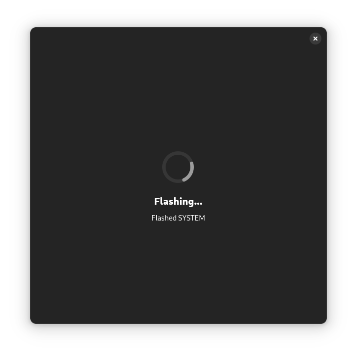
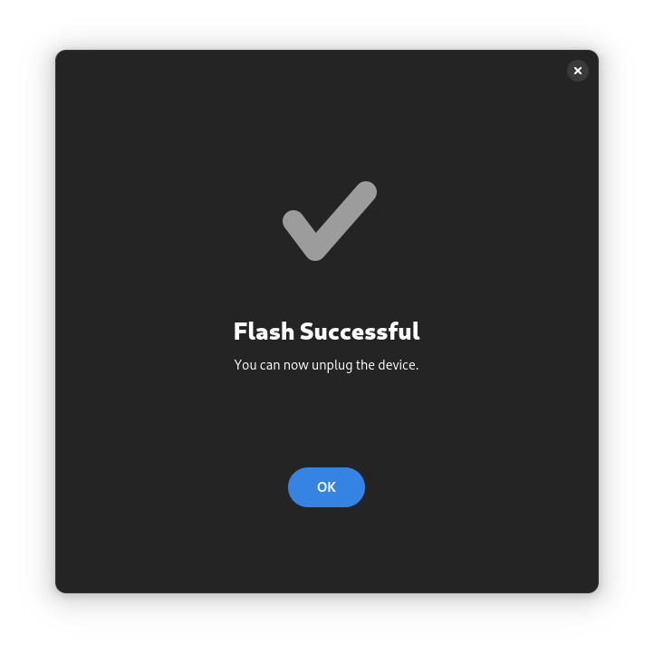

<h1 align="center">Galaxy Flasher</h1>

A GUI for Samsung flash-tools.

[Codeberg](https://codeberg.org/ethical_haquer/Galaxy-Flasher) | [XDA](https://xdaforums.com/t/linux-galaxy-flasher-a-gui-for-samsung-flash-tools.4636402/)

  
<b>Screenshots</b>

   
  Start Page:
   
  <picture>
    <source media="(prefers-color-scheme: dark)" srcset="/assets/screenshots/galaxy-flasher-start-page-dark.png">
    <source media="(prefers-color-scheme: light)" srcset="/assets/screenshots/galaxy-flasher-start-page-dark.png">
    
  </picture>
   
  Select Files Page:
   
  <picture>
    <source media="(prefers-color-scheme: dark)" srcset="/assets/screenshots/galaxy-flasher-select-files-page-dark.png">
    <source media="(prefers-color-scheme: light)" srcset="/assets/screenshots/galaxy-flasher-select-files-page-dark.png">
    
  </picture>
   
  Select Partitions Page:
   
  <picture>
    <source media="(prefers-color-scheme: dark)" srcset="/assets/screenshots/galaxy-flasher-select-partitions-page-dark.png">
    <source media="(prefers-color-scheme: light)" srcset="/assets/screenshots/galaxy-flasher-select-partitions-page-dark.png">
    
  </picture>
   
  Verify Flash Page:
   
  <picture>
    <source media="(prefers-color-scheme: dark)" srcset="/assets/screenshots/galaxy-flasher-verify-flash-page-dark.png">
    <source media="(prefers-color-scheme: light)" srcset="/assets/screenshots/galaxy-flasher-verify-flash-page-dark.png">
    
  </picture>
   
  Flash Progress Page:
   
  <picture>
    <source media="(prefers-color-scheme: dark)" srcset="/assets/screenshots/galaxy-flasher-flash-progress-page-dark.png">
    <source media="(prefers-color-scheme: light)" srcset="/assets/screenshots/galaxy-flasher-flash-progress-page-dark.png">
    
  </picture>
   
  Flash Successful Page:
   
  <picture>
    <source media="(prefers-color-scheme: dark)" srcset="/assets/screenshots/galaxy-flasher-flash-complete-page-dark.png">
    <source media="(prefers-color-scheme: light)" srcset="/assets/screenshots/galaxy-flasher-flash-complete-page-dark.png">
    
  </picture>

## Background

After witnessing a new Linux user, who had just switched over from Windows, struggle with using Odin4's CLI, I decided to make a GUI for Thor: Thor GUI. With the release of v0.5.0, Thor GUI was renamed Galaxy Flasher, and it now supports Thor and Odin4.

## Disclaimer

Currently, Galaxy Flasher is in an Alpha stage. There are known (and unknown) bugs. A list of missing features and know bugs in the **latest release** can be found below.

## Known Bugs

- The docs need to be updated to tell users that they need to edit the udev rules before using GF, see [here](https://xdaforums.com/t/linux-galaxy-flasher-a-gui-for-samsung-flash-tools.4636402/page-5#post-89813072).
- You have to restart Galaxy Flasher after changing a flash-tool executable for it to apply, see [here](https://xdaforums.com/t/linux-galaxy-flasher-a-gui-for-samsung-flash-tools.4636402/page-5#post-89813766).
- build-python.sh is broken, don't use it.

## TODO

- Improve the flash progress updates. [Odin4]
- Add a CONTRIBUTING.md file.
- Add support for Heimdall.
- Fully support Linux arm64.
- Display the partitions to be flashed in the Verify Flash Window.
- Make Galaxy Flasher easier to install.

## Supported platforms

- [x] Linux x64
- [ ] Linux arm64 (WIP, only Thor can be used)
- [ ] Windows
- [ ] macOS

## Supported flash-tools

- Odin4
- Thor

## Installation and Usage

For how to install and use Galaxy Flasher, refer to the [Galaxy Flasher documentation](https://galaxy-flasher-docs.readthedocs.io/en/latest/).

## How you can help

Here are some ways you can help me improve/finish Galaxy Flasher:
+ Find and report bugs. If you find an issue that isn't listed as a [known bug](https://codeberg.org/ethical_haquer/Galaxy-Flasher#known-bugs), and isn't listed [here](https://codeberg.org/ethical_haquer/Galaxy-Flasher/issues), please let me know!
+ ~Help translate Galaxy Flasher into your language. Refer to [this readme](https://codeberg.org/ethical_haquer/Galaxy-Flasher/src/branch/main/source/locales/README.md) for more info~. NOTE: Currently, the en.json file is in dire need of updating after the re-write, so please don't add other translations until it is updated. Thanks!
+ Improve the code. Pull requests are always welcome!
+ Suggest an improvement by opening up a [feature request](https://codeberg.org/ethical_haquer/Galaxy-Flasher/issues/new/choose)!

## Credits

[TheAirBlow](https://github.com/theairblow) for posting [Odin4](https://xdaforums.com/t/official-samsung-odin-v4-1-2-1-dc05e3ea-for-linux.4453423/) to XDA, and for creating the [Thor Flash Utility](https://github.com/Samsung-Loki/Thor).

[justaCasualCoder](https://github.com/justaCasualCoder) for his contributions, and for starting the port to GTK4 on his own.

[piero-e@XDA](https://xdaforums.com/m/piero-e.12055017/), [piero@/e/OS](https://community.e.foundation/u/piero/summary) for supporting the app, and helping out users.

[ethical_haquer](https://codeberg.org/ethical_haquer/) for Galaxy Flasher.

## License

Galaxy Flasher is licensed under GPLv3. Please see [`LICENSE`](./LICENSE) for the full license text.
